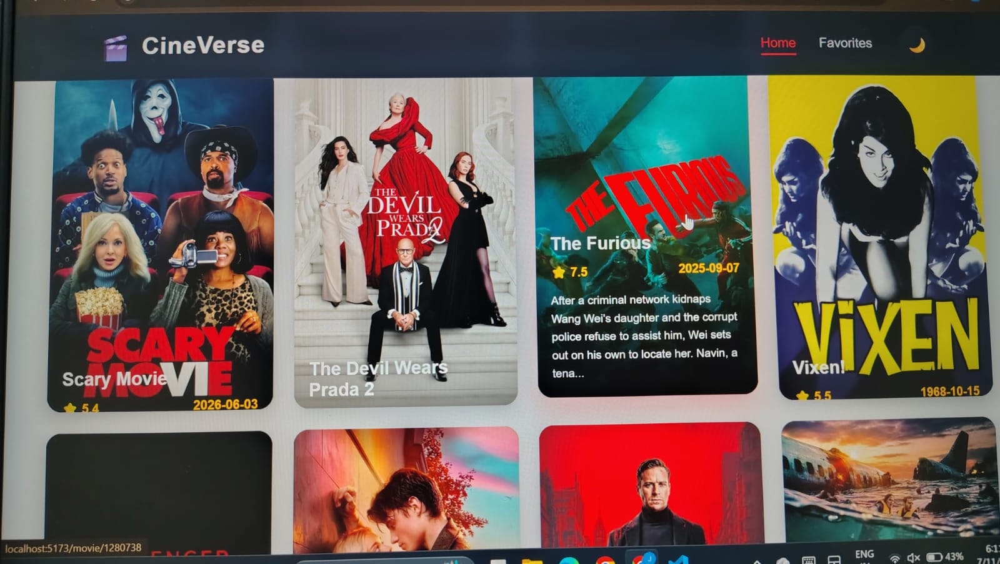
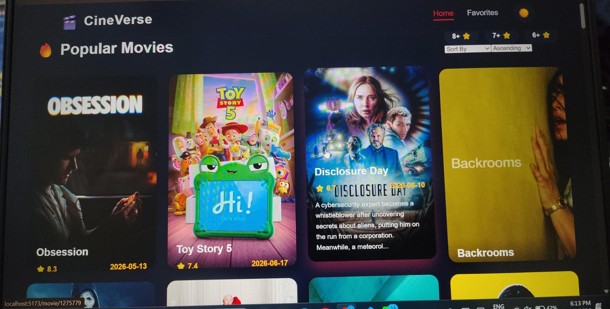

# 🎬 CineVerse

A modern, responsive movie discovery application built with **React**, **Vite**, and the **TMDB API**. CineVerse allows users to explore popular, trending, top-rated, and upcoming movies with an intuitive interface, advanced filtering, sorting, favorites, and a seamless dark/light theme experience.

---

## 🚀 Live Demo

🌐 **Live Website:** https://Movie-app.netlify.app

---

## 📸 Application Preview

### 🏠 Home Page



---

### 🎥 Movie Details



---

## ✨ Key Features

- 🎬 Browse Popular Movies
- 🔥 Explore Trending Movies
- ⭐ Discover Top Rated Movies
- 📅 View Upcoming Releases
- 🎥 Detailed Movie Information
- ⭐ Filter Movies by Rating
- 📊 Sort by Rating & Release Date
- ❤️ Add Movies to Favorites
- 🌙 Dark / Light Theme
- 📱 Fully Responsive Design
- ⚡ Fast Performance with Vite
- 🔄 Dynamic Data from TMDB API
- 🎨 Clean & Modern User Interface

---

## 🛠 Tech Stack

| Category | Technologies |
|----------|--------------|
| Frontend | React, JavaScript (ES6+) |
| Routing | React Router DOM |
| Build Tool | Vite |
| Styling | CSS3 |
| API | TMDB API |
| State Management | React Hooks |
| Package Manager | npm |

---

## 📂 Project Structure

```
Movie-App
│
├── public
│
├── Screenshots
│
├── src
│   ├── Assets
│   ├── Components
│   │     ├── DarkMode
│   │     ├── MovieCard
│   │     ├── MovieList
│   │     └── Navbar
│   │
│   ├── Pages
│   │     ├── Home
│   │     ├── Trending
│   │     ├── Favorites
│   │     ├── MovieDetails
│   │     ├── About
│   │     └── NotFound
│   │
│   ├── Services
│   │
│   ├── App.jsx
│   ├── main.jsx
│   └── index.css
│
├── package.json
├── vite.config.js
└── README.md
```

---

## ⚙ Installation & Setup

### Clone the repository

```bash
git clone https://github.com/Jyothsna-Priya9676/Movie-App.git
```

### Navigate to the project folder

```bash
cd Movie-App
```

### Install dependencies

```bash
npm install
```

### Configure Environment Variables

Create a `.env` file in the project root.

```env
VITE_TMDB_API_KEY=YOUR_TMDB_API_KEY
```

### Start the development server

```bash
npm run dev
```

### Build for production

```bash
npm run build
```

---

## 🌐 API Used

This project uses **The Movie Database (TMDB) API** to fetch real-time movie information.

🔗 https://developer.themoviedb.org/

---

## 🚀 Upcoming Features

- 🔍 Smart Movie Search
- 🎬 Movie Trailers
- 👥 Cast & Crew Details
- 📝 User Reviews
- 🎯 Infinite Scrolling
- 🔐 User Authentication
- ☁ Cloud Sync for Favorites
- 📈 Pagination
- 🎭 Genre Filtering
- 🤖 AI Movie Recommendations

---

## 💻 Skills Demonstrated

- React Component Architecture
- React Hooks
- API Integration
- React Router
- Responsive Web Design
- State Management
- Dynamic Rendering
- Conditional Rendering
- Reusable Components
- Modern CSS
- Clean Folder Structure

---

## 👩‍💻 Author

### Jyothsna Priya

📧 Email: your-email@example.com

💼 LinkedIn

https://www.linkedin.com/in/jyothsna-priya-ardhamala-841299328/

🐙 GitHub

https://github.com/Jyothsna-Priya9676

---

## ⭐ Support

If you found this project helpful, please consider giving it a ⭐ on GitHub.

It helps support the project and motivates further improvements.

---

## 📜 License

This project is developed for learning and portfolio purposes.
